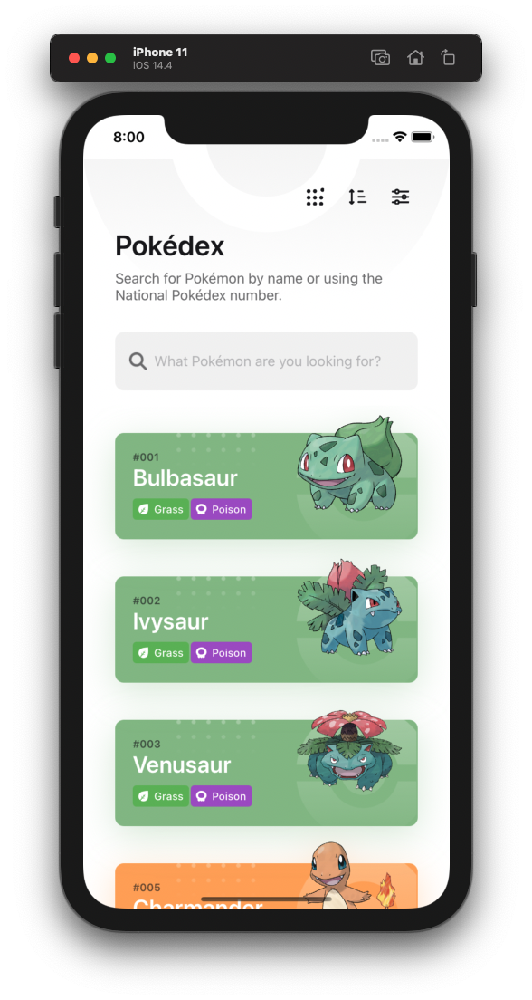
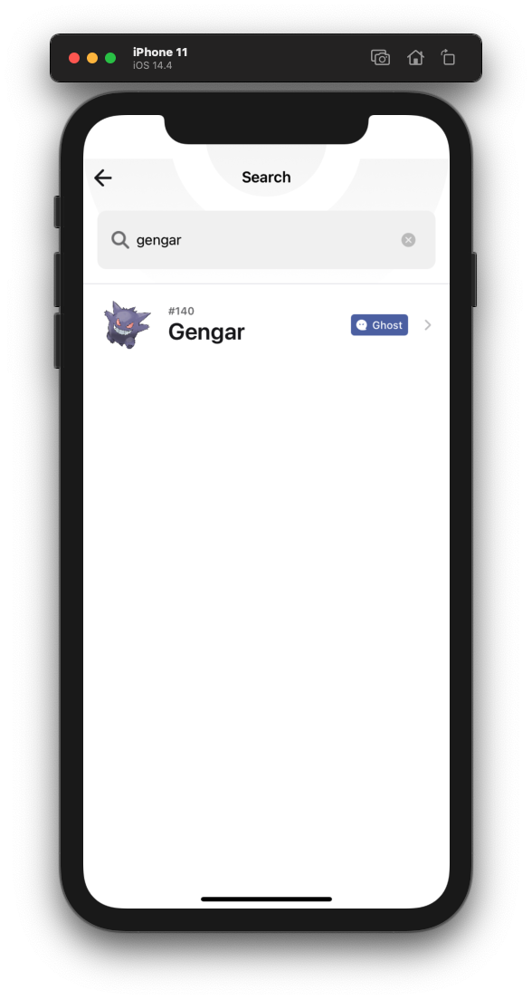
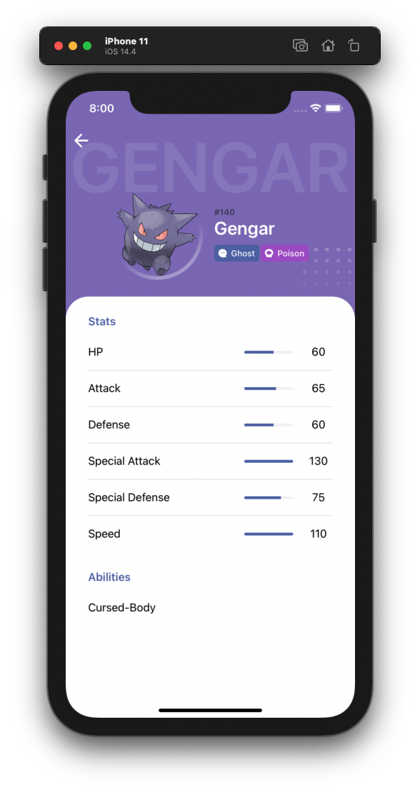

# Pokédex MVP

Construção de uma pokédex utilizando Swift com o pattern MVP

## Como executar o projeto

Para executar o projeto siga as seguintes instruções:

1. Faça o clone do projeto em seu computador
2. E necessário ter o cocoapods instalado, caso não tenha, [clique aqui](https://cocoapods.org/).
3. Utilizando o terminal acesse rais da pasta do projeto e execute o comando `pod install` e ao fim do processo, abra o arquivo `Pokedex-MVP.xcworkspace`.
4. Para executar o projeto livremente, e necessário mudar o `bundle identifier` para isso, toque sobre o `target do projeto` > `General` e mude o bundle identifier.
5. Também é indicado selecionar a `team` correta em `signing e capabilities`.
6. Toque em `run`.

## Detalhes adicional

As telas de `filtro`, `sort` e `generations` estão apenas com imagens do layout pois não eram requisitos principais.

## API

Esse estudo utilizou a API pública https://pokeapi.co/
